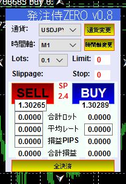

# 発注侍ZEROのソースを公開

* Metatrader4のチャート上でExpert Adviser機能を使って動作します。
* 発注侍ZEROは、GUI用OSSである「mt4gui2」を利用しています。

# Expertsフォルダ(EA本体のソース）
* hatyusamurai_zero.mq4

# Includeフォルダ
* bushido_commonutils.mqh
* bushido_trailing.mgh
* mt4gui2.mgh

# Librariesフォルダ
* mt4gui2.dll(※）

mt4gui2.dllを以下のサイトからダウンロードします。

http://www.mt4gui.com/download/